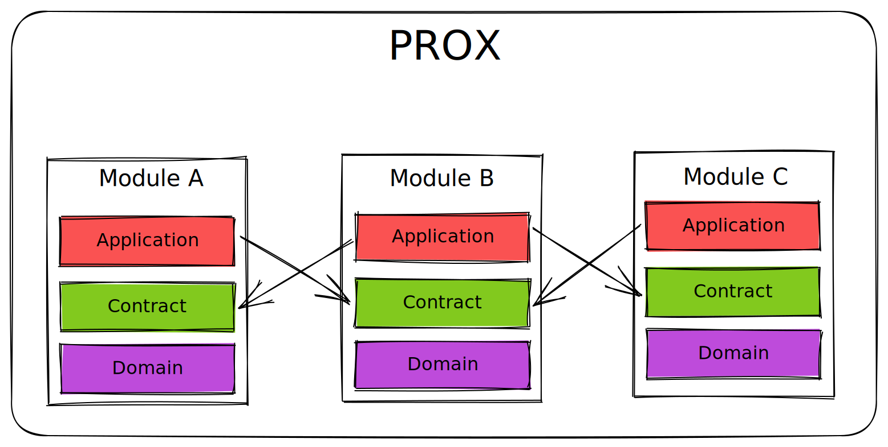
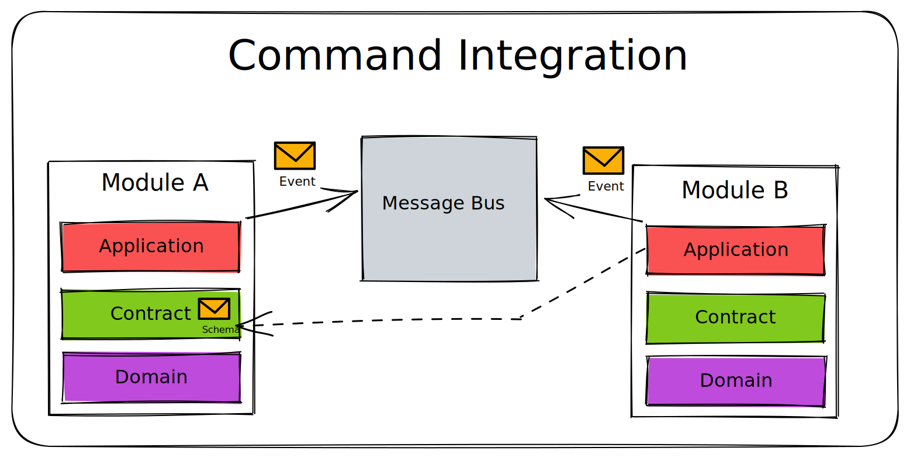
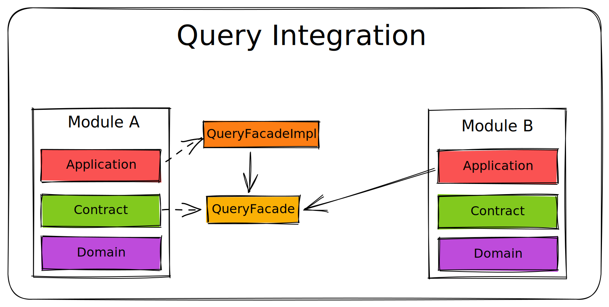

# PROX Backend

[](https://quay.io/repository/innovation-hub-bergisches-rheinland/prox-backend)

Backend service of the web-application [PROX](https://prox.aws.innovation-hub.de).

## Technical Documentation

### Architecture

At the moment, the service is still being developed and some architectural decisions are still
in progress. The following documentation is a first draft and will be updated.
Some parts of the architecture might be subject to change but the general notion of it should
remain the same.

The architecture is meant to be as simple as possible. We do not want to
over-engineer the application. However, it is challenging to find the right balance to simplicity.
Therefore, we are likely to improve it over time and don't carve it in stone yet.

We strive to build a structured/modular monolith application, which should be easy to understand,
develop and deploy. We don't think a microservice architecture is necessary for this application
and would add more complexity.

A big notion of the architecture is to leverage DDD principles and **keep the domain model clean**.

#### Modules

- We try to **keep modules small** and **easy to understand** as possible
  - Every module is layered in a consistent way. At the time of writing we have the following
    layers:
    - **Domain**: The domain model of the module
    - **Contract**: The integration layer of the module. It contains interfaces and definition to
      integrate with other modules
    - **Application**: The application layer of the module
- Each module represents a **bounded context** in the domain
- A module **should** never issue a **command to another module**. It **should** prefer event mechanisms
  - If a inter-module modification is required, it should fire an event and the other module should 
    react to it.
  - If a module needs to read data from another module, it should use a facade inside the contract
    module of the other module.
  - However, in some cases it might be necessary or pragmatic to issue a command to another module.
    For example it is way more efficient to issue a command for updating the TagCollection instead
    of making up a new event in every module which needs to be tested.

The following diagrams should give you a rough idea of the module structure.





#### Architectural Decisions

- We use [Spring Boot](https://spring.io/projects/spring-boot) as the application framework
- We accept coupling the persistence Logic to the domain model and
  use [Spring Data JPA](https://spring.io/projects/spring-data-jpa) to persist the domain model
- We avoid God-Services and use small, testable Use-Cases instead
- References between Aggregates **should** always be referenced by Identity.
- For internal events we use the internal event bus of the Spring Framework
  - Internal events are events that we fired from inside PROX. They are not meant to be consumed
    by external systems.
- For external events we use [RabbitMQ](https://www.rabbitmq.com/) as the message broker.
  - External events are events that are meant to be consumed by external systems or we consume them
    from external systems.
- We copy data from our Identity Provider to our own database to avoid coupling to the Identity
  Provider. We use [Keycloak](https://www.keycloak.org/) as the Identity Provider. Keycloak emits 
  registration events to RabbitMQ. We consume these events and copy the data to our database.
  This way we can use our own database as the source of truth for user data (Display Name, Email, ...)
  and use Keycloak only for authentication. The approach might not scale well we could use one of 
  the following approaches in the future, but for now it is good enough:
  - [Extend Keycloak Data Schema](https://www.keycloak.org/docs/latest/server_development/index.html#_extensions_jpa) 
    and use Keycloak as the source of truth
  - Use custom user attributes in Keycloak and use Keycloak as the source of truth
  - Drop Keycloak and use [Spring Security OAuth](https://spring.io/projects/spring-security-oauth)
    instead. Not really preferred because we might need things like SAML or OpenID Connect, User 
    Federation in the future.

## Release

Realeasing a new version is done with
the [gradle-release plugin](https://github.com/researchgate/gradle-release).

```sh
./gradlew release
```

Note that the plugin will automatically create release commits and pushes your changes.